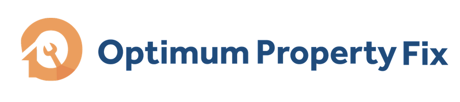
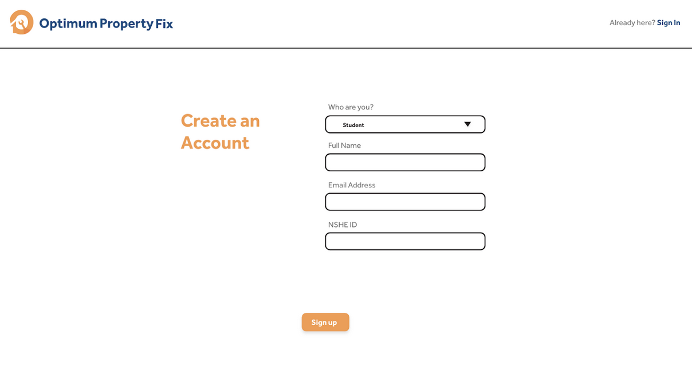
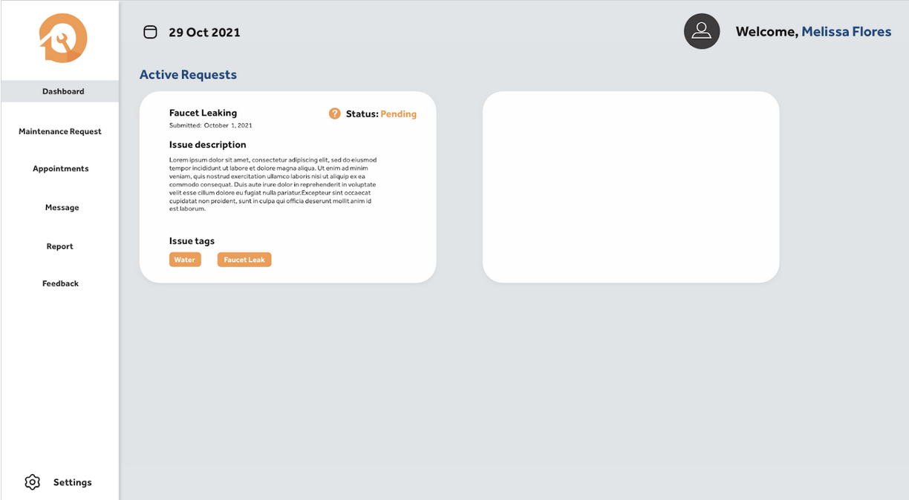
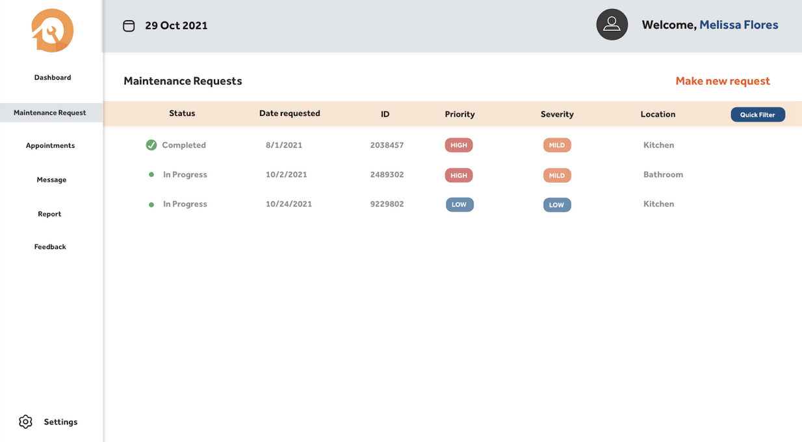
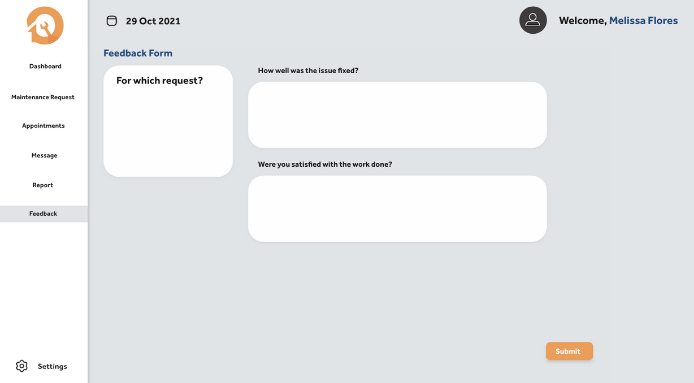

# CS 425/426: Senior Capstone Project

The University of Nevada, Reno’s (UNR) dormitory maintenance requests system presents itself as a problem in need of improvement ridden with inconveniences and flaws to dormitory students. The intended audience of Optimum Property Fix (OPF) are dormitory students at UNR and facilities services for dormitories. OPF is a planned approach to solving this problem through web technologies and advancements in Artificial Intelligence.

## Documentation

[Project Documentation](https://github.com/joannalopez223/UNR-Capstone/tree/main/Project%20Assignments) - The accompanied project assignment outline requirements and spefications including technology justifications throughout the year for the University of Nevada, Reno senior capstone project, OPF.

## Features

- Light/dark mode toggle
- Fullscreen mode
- Cross platform

## 🛠 Skills
- Javascript
- HTML
- CSS
- MySQL
- Python

## Tech Stack

**Client:** React

**Server:** Node

## Screenshots

## Demo

Insert gif or link to demo

## Authors

- Joanna Lopez [@joannalopez223](https://www.github.com/joannalopez223)
- Araam Zaremenhrjardi [@araamz](https://www.github.com/araamz)
- Melissa Flores [@melissaflores417](https://www.github.com/melissaflores417)
- Nasrin Juana [@njuana](https://www.github.com/njuana)
- Aisha Co [@Zelrene](https://www.github.com/Zelrene)

## Acknowledgements

 - Advisor: Erin Keith [@erinkeith](https://www.github.com/erinkeith)

## Appendix

Any additional information goes here

## 🔗 Links

## Feedback

If you have any feedback, please reach out to us at opf@opf.com

## License

Copyright 2021: The University of Nevada, Reno. All Rights Reserved. 
[UNR](https://www.unr.edu/enterprise/ip-ownership)
